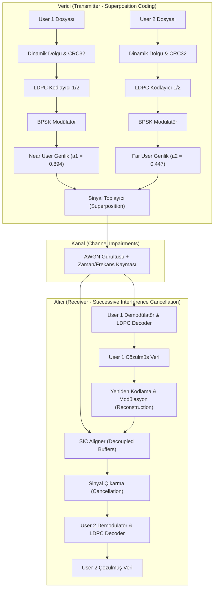

# 🛰️ USRP E310 & LoRaWAN Sinyal Analizi ve BPSK NOMA Haberleşme Projesi

Bu proje, güce dayalı bölmeli (Power-Domain) Non-Orthogonal Multiple Access (NOMA - Dikgen Olmayan Çoklu Erişim) teknolojisinin BPSK modülasyonu, LDPC Kanal Kodlaması ve Ardışık Girişim Giderme (SIC - Successive Interference Cancellation) algoritmalarıyla entegre edildiği kapsamlı bir yazılım tanımlı radyo (SDR) projesidir.

Proje, iki temel çalışma modunu birleştirir:
1.  **Loopback Simülasyonu:** GNU Radio Companion (GRC) simülasyon ortamında kanaldaki gürültü ve faz/frekans kaymalarına karşı kararlılığın ve bit hata oranlarının (BER/BLER) test edilmesi.
2.  **USRP OTA (Over-the-Air) İletimi:** Gerçek RF donanımları (USRP E310) ve host bilgisayarlar kullanılarak kablosuz ortamda dosya/resim aktarımının gerçekleştirilmesi.

### 🔄 Çalışma Modları Karşılaştırması

Projenin iki ana çalışma modu (Loopback ve USRP OTA) arasındaki farklar ve kullanım amaçları aşağıda özetlenmiştir:

| Özellik | Simülasyon (Loopback) | Donanım (USRP OTA) |
| :--- | :--- | :--- |
| **Çalışma Ortamı** | GNU Radio & Kanal Simülatörü | Fiziksel RF Donanımı (USRP E310) |
| **Kanal Modeli** | AWGN, Rayleigh Fading, Donanım Sapmaları | Gerçek Dünya Kablosuz Yayılımı |
| **Temel Amaç** | Hata analizi (BER/BLER) ve sınır değer testleri | Gerçek zamanlı kablosuz resim/dosya aktarımı |
| **Ana Betik** | `gnuradio_loopback/run_image_transfer.py` | `usrp/run_host_transfer.py` |

---


## 📐 Sistemin Genel Tasarımı ve Matematiksel Altyapısı

Sistem, iki kullanıcılı bir güç bölgesi çoklamalı (Power-Domain NOMA) BPSK iletim hattını modeller. İki kullanıcının verisi aynı anda ve aynı frekansta, ancak farklı güç seviyelerinde süperpoze edilerek havaya gönderilir.



### 1. Verici (Transmitter) Aşaması
*   **Dinamik Dolgulamalı Paketleme:** İletilecek veriler, LDPC blok sınırlarına ve akış sürekliliğine uymak için paket başına 77 bayt olacak şekilde düzenlenir. Kısa olan veri, GNU Radio zamanlayıcısının bloke olmasını engellemek amacıyla sıfır baytları (`0x00`) ile dinamik olarak doldurulur (padding).
*   **LDPC Kodlama:** `n_1296_k_0648_ieee.alist` matrisi kullanılarak 1/2 oranında parite kontrol kodlaması (LDPC) uygulanır.
*   **Güç Paylaşımı (Power Allocation):** Near User (User 1) sinyali $a_1 = 0.894$ (gücün $\%80$'i), Far User (User 2) sinyali ise $a_2 = 0.447$ (gücün $\%20$'si) genlikleriyle çarpılarak süperpoze edilir:
    $$s_{noma}(t) = a_1 x_1(t) + a_2 x_2(t)$$

### 2. Alıcı (Receiver - SIC) Aşaması
*   **User 1 Çözümü:** Gücü yüksek olan User 1 sinyali, zayıf olan User 2 sinyali gürültü kabul edilerek doğrudan demodüle edilir ve çözülür ($\hat{x}_1$).
*   **Zaman Hizalamalı Girişim Giderme (SIC):** Çözülen User 1 verisi yeniden kodlanıp modüle edilir. Alıcıdaki **Decoupled SIC Aligner** bloğu, asenkron dahili kuyruklar (queues) yöneterek `gr.sync_block` kilitlenmesini engeller. Gecikme sapmalarını kompanse etmek için **`-16` sembollük** zaman hizalama kayması uygulayarak girişim çıkarma işlemini gerçekleştirir:
    $$r_{clean}(t) = r(t) - a_1 \hat{x}_1(t)$$
*   **User 2 Çözümü:** Girişimi sıfırlanmış $r_{clean}(t)$ sinyali üzerinden zayıf olan User 2 verisi çözülür.

---

## 🗂️ Proje Klasör Yapısı

Proje dosyaları karmaşıklığı engellemek için modüller halinde klasörlenmiştir:

```text
├── README.md                           # Ana Proje Rehberi (Bu Dosya)
├── LICENSE                             # Lisans Dosyası
├── .gitignore                          # Git Dışlama Kural Dosyası
├── usrp/                               # USRP Donanım ve Gerçek Zamanlı OTA Klasörü
│   ├── README.md                       # USRP Donanım Kurulumu ve İletişim Rehberi
│   ├── run_host_transfer.py            # USRP OTA Transfer Yönetici Wrapper Betiği
│   ├── TX_host.grc / RX_host.grc       # Host PC GNU Radio Companion Çizimleri
│   ├── TX_host.py / RX_host.py         # GRC'den Derlenen Python Akış Grafikleri
│   └── (diğer yardımcı donanım kodları...)
├── gnuradio_loopback/                  # GRC Simülasyon ve Analiz Klasörü
│   ├── README.md                       # Simülasyon, SIC ve Akademik Analiz Rehberi
│   ├── run_image_transfer.py           # Simülasyon Uçtan Uca Wrapper Betiği
│   ├── NOMA.grc / NOMA.py              # Simülasyon GRC ve Python Akış Kodları
│   ├── noma_ldpcsiz/                   # Karşılaştırma Amaçlı LDPC'siz NOMA Arşivi
│   └── (diğer simülasyon blok kodları...)
└── tests/
    └── ber_waterfall/                  # Test Sonuç Verileri (Grafikler ve JSON)
```

---

## ⚙️ Wrapper Dosyaları ve Çalışma Mekanizmaları

GNU Radio Companion'dan derlenen Python akış grafikleri (`NOMA.py`, `TX_host.py` vb.), doğası gereği dosya okuma/yazma senkronizasyonu, dinamik boyut yönetimi ve arabellek kilitlenmelerini yönetmekte yetersiz kalmaktadır. Projede bu akışları sarmalayarak (wrap) kontrol eden **Wrapper Betikleri** geliştirilmiştir:

### 1. Simülasyon Wrapper Betiği: `gnuradio_loopback/run_image_transfer.py`
*   **Dinamik Padding & Stripping:** Gönderilecek iki farklı PNG resminin boyutlarını okur, kısa olan dosyayı vericiye vermeden önce 77 baytın katlarına dolgular. Alıcı tarafta veriyi yakalar, dolgu sıfırlarını kırparak orijinal dosyayı hatasız çıkartır.
*   **Süreç Yönetimi (Lock / Process Cleanup):** Arka planda askıda kalan eski simülasyon python süreçlerini (`NOMA.py`) dinamik olarak tespit eder ve sonlandırır (`taskkill`). Bu sayede SDR dosya kilitlenme sorunlarını önler.
*   **Bütünlük Doğrulaması:** Kurtarılan dosyaların MD5 hash değerlerini hesaplayarak gönderilen dosyalarla birebir eşleştiğini doğrular.

### 2. Donanım Wrapper Betiği: `usrp/run_host_transfer.py`
*   **Akıllı Paketleme ve Metadata Entegrasyonu:** Gönderilmek istenen herhangi bir dosyanın (fotoğraf, metin veya ikili dosya) başına otomatik olarak **16 baytlık boyut, uzantı ve MD5 başlığı** ekler.
*   **Alıcı Sessizlik Aşımı (Idle Timeout):** Havadan veri akışı bittiğinde USRP alıcısının takılı kalmasını önlemek amacıyla 5 saniyelik sessizlik algıladığında akış şemasını otomatik olarak durdurur ve dosyayı kırparak diske yazar.

---

## 🛠️ Kurulum ve Sistem Gereksinimleri

Projenin çalıştırılması ve geliştirilmesi için gereken sistem ortamı ve bağımlılıkları aşağıda belirtilmiştir:
*   **İşletim Sistemi:** Windows (Simülasyon testleri için) / Linux Arch (USRP Host bilgisayarlar için).
*   **Yazılım Platformu:** GNU Radio v3.10.x & Radioconda (Python v3.10+ ve uyumlu kütüphaneler).
*   **Gerekli Python Kütüphaneleri:** `numpy`, `scipy` (sinyal işleme ve hizalama hesaplamaları için), `PyQt5` (GNU Radio grafiksel arayüz tetiklemeleri için).
