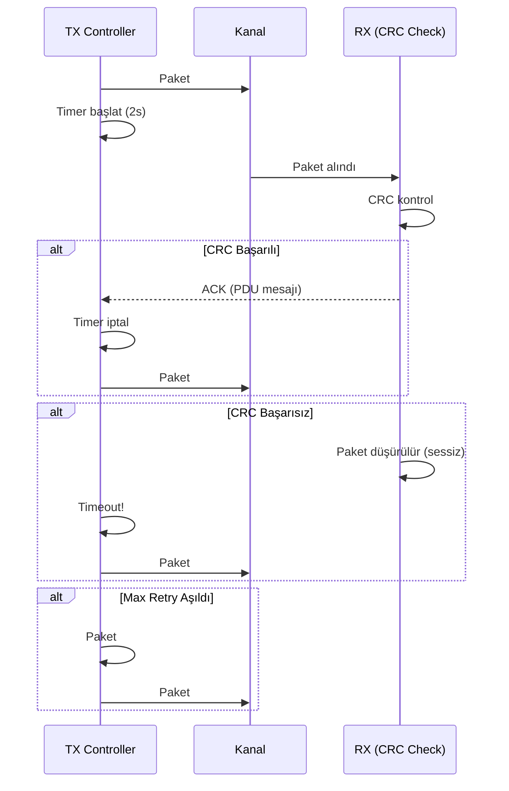

# LDPC Sistemine Feedback Loop Ekleme

## Proje Yol Haritası

| Faz | Özellik | Öncelik |
|-----|---------|---------|
| **Phase 1** | Basit ACK/NACK Feedback Loop | ⬆️ Yüksek |
| **Phase 2** | HARQ Chase Combining | ⬆️ Yüksek |
| **Phase 3** | NOMA | ⬆️ En Yüksek |
| **Phase 4** | Adaptif Kodlama/Modülasyon | ⬇️ Düşük |

Bu plan **Phase 1: Basit ACK/NACK Feedback Loop** implementasyonunu kapsar.

---

## Tasarım Kararları

| Karar | Seçim | Sebep |
|-------|-------|-------|
| Custom block sayısı | Sadece 1 (TX Controller EPB) | GNU Radio built-in blokları mümkün olduğunca kullanılacak |
| RX tarafı değişiklik | Yok — mevcut bloklar aynen kalıyor | CRC check bloğunun PDU çıkışı zaten ACK görevi görüyor |
| Sequence number | Yok | Dosyalara dokunulmayacak, Stop-and-Wait'te tek paket in-flight |
| NACK mekanizması | Timeout (2000ms) | CRC fail → paket düşer → PDU yok → TX timeout = implicit NACK |
| Dosya formatı | Değişiklik yok (77 byte payload, 770 byte toplam) | Mevcut snippet'lar ve doğrulama korunuyor |
| Dil | Python EPB | Host PC kontrolcü, USRP sadece RF, performans kritik değil |

---

## Mevcut Sistem vs Yeni Sistem

### Mevcut TX Girişi
```
File Source → Stream to Tagged Stream(77) → CRC Add → ... mevcut zincir
```

### Yeni TX Girişi
```
TX Controller EPB →(PDU msg)→ PDU to Tagged Stream →(tagged stream)→ CRC Add → ... mevcut zincir
```

### Mevcut RX Çıkışı (DEĞİŞMİYOR)
```
... → CRC Check → File Sink
                → Tagged Stream to PDU → Message Debug
```

### Yeni RX Çıkışı
```
... → CRC Check → File Sink                          (aynı)
                → Tagged Stream to PDU → TX Controller (feedback)
```

> [!TIP]
> RX zincirinde **tek değişiklik**: `Message Debug` bloğu yerine `TX Controller EPB`'nin feedback portuna bağlantı. Tüm RX blokları aynen kalıyor.

---

## Mimari

```mermaid
graph LR
    subgraph TX Yeni
        TXC["TX Controller<br/>(EPB)"] -->|PDU msg| PTS[PDU to<br/>Tagged Stream]
        PTS -->|tagged stream<br/>77 byte| CRC[CRC Add]
        CRC --> REPACK[Repack 8→1]
        REPACK --> SCRAMBLE[Scrambler]
        SCRAMBLE --> LDPC_E[LDPC Encoder]
        LDPC_E --> MUX_CHAIN["... → MUX → Mod"]
    end

    subgraph Kanal
        MUX_CHAIN --> CH[Channel Model]
    end

    subgraph "RX (Değişiklik Yok)"
        CH --> RX_CHAIN["Demod → Sync → ...]"]
        RX_CHAIN --> LDPC_D[LDPC Decoder]
        LDPC_D --> DESCR[Descrambler]
        DESCR --> CRC2[CRC Check]
        CRC2 -->|valid data| FS[File Sink]
        CRC2 -->|valid data| PDU_CONV[Tagged Stream<br/>to PDU]
    end

    PDU_CONV -.->|"ACK (PDU msg)"| TXC
    
    style TXC fill:#4CAF50,color:white
    style PTS fill:#2196F3,color:white
    style PDU_CONV fill:#FF9800,color:white
```



### Stop-and-Wait ARQ Protokolü



---

## Yapılacak Değişiklikler

### Kaldırılacak Bloklar
| Blok | Sebep |
|------|-------|
| `blocks_file_source_0` | TX Controller EPB ile değiştirilecek |
| `blocks_stream_to_tagged_stream_0_0_0` | PDU to Tagged Stream ile değiştirilecek |
| `blocks_message_debug_0` | Feedback bağlantısı ile değiştirilecek |

### Eklenecek Bloklar
| Blok | Tip | Açıklama |
|------|-----|----------|
| `tx_controller` | Embedded Python Block | Stop-and-Wait ARQ kontrol bloğu |
| `pdu_to_tagged_stream` | Built-in GNU Radio | PDU → tagged stream dönüştürücü |

### Değişen Bağlantılar

```diff
  # TX Girişi
- blocks_file_source_0 → blocks_stream_to_tagged_stream_0_0_0 → digital_crc32_bb_0
+ tx_controller →(msg: tx_pdu)→ pdu_to_tagged_stream → digital_crc32_bb_0

  # RX Feedback
- pdu_tagged_stream_to_pdu_0 →(msg: pdus)→ blocks_message_debug_0
+ pdu_tagged_stream_to_pdu_0 →(msg: pdus)→ tx_controller (feedback port)
```

### Korunan Bloklar (Değişiklik Yok)

TX zinciri (`digital_crc32_bb_0`'dan itibaren tamamı), RX zincirinin tamamı, tüm değişkenler, snippet'lar — hepsi aynen kalıyor.

---

## TX Controller EPB Detaylı Tasarım

```python
"""
Embedded Python Block: TX Controller
Stop-and-Wait ARQ protokolü ile dosyadan paket gönderimi
"""
import numpy as np
from gnuradio import gr
import pmt
import threading

class tx_controller(gr.basic_block):
    """Stop-and-Wait ARQ TX Controller"""
    
    def __init__(self, filename="bpsk_transmit.txt", payload_size=77,
                 timeout_ms=2000, max_retries=5):
        gr.basic_block.__init__(
            self,
            name='TX Controller',
            in_sig=[],
            out_sig=[]
        )
        
        # Message port'ları
        self.message_port_register_out(pmt.intern("tx_pdu"))
        self.message_port_register_in(pmt.intern("feedback"))
        self.set_msg_handler(pmt.intern("feedback"), self.handle_feedback)
        
        # Parametreler
        self.filename = filename
        self.payload_size = payload_size
        self.timeout_sec = timeout_ms / 1000.0
        self.max_retries = max_retries
        
        # Durum
        self.packets = []
        self.current_idx = 0
        self.retry_count = 0
        self.timer = None
        self.lock = threading.Lock()
        self.done = False
        
    def start(self):
        # Dosyayı oku ve paketlere böl
        with open(self.filename, "rb") as f:
            raw = f.read()
        self.packets = []
        for i in range(0, len(raw), self.payload_size):
            chunk = raw[i:i+self.payload_size]
            if len(chunk) == self.payload_size:
                self.packets.append(chunk)
        
        print(f"[TX] {len(self.packets)} paket hazır ({self.payload_size} byte/paket)")
        
        # İlk paketi gönder
        self.current_idx = 0
        self.retry_count = 0
        self.done = False
        self.send_current_packet()
        return True
    
    def send_current_packet(self):
        if self.current_idx >= len(self.packets):
            self.done = True
            print(f"[TX] === Tüm paketler başarıyla gönderildi ===")
            return
        
        data = self.packets[self.current_idx]
        pdu = pmt.cons(pmt.PMT_NIL, 
                       pmt.init_u8vector(len(data), list(data)))
        self.message_port_pub(pmt.intern("tx_pdu"), pdu)
        
        # Timeout timer başlat
        self.start_timer()
        
        action = "gönderildi" if self.retry_count == 0 else f"yeniden gönderildi (retry #{self.retry_count})"
        print(f"[TX] Paket {self.current_idx+1}/{len(self.packets)} {action}")
    
    def start_timer(self):
        if self.timer is not None:
            self.timer.cancel()
        self.timer = threading.Timer(self.timeout_sec, self.on_timeout)
        self.timer.daemon = True
        self.timer.start()
    
    def on_timeout(self):
        with self.lock:
            if self.done:
                return
            self.retry_count += 1
            if self.retry_count > self.max_retries:
                print(f"[TX] Paket {self.current_idx+1} max retry ({self.max_retries}) aşıldı, atlanıyor!")
                self.current_idx += 1
                self.retry_count = 0
            else:
                print(f"[TX] Timeout! Paket {self.current_idx+1} için ACK alınamadı")
            self.send_current_packet()
    
    def handle_feedback(self, msg):
        with self.lock:
            if self.done:
                return
            
            # ACK alındı (CRC geçen her PDU bir ACK'tir)
            if self.timer is not None:
                self.timer.cancel()
            
            print(f"[TX] ACK alındı! Paket {self.current_idx+1}/{len(self.packets)}")
            self.current_idx += 1
            self.retry_count = 0
            self.send_current_packet()
    
    def stop(self):
        if self.timer is not None:
            self.timer.cancel()
        print(f"[TX] Sonuç: {self.current_idx}/{len(self.packets)} paket tamamlandı")
        return True
```

> [!NOTE]
> **Neden sadece ACK, NACK yok?** Mevcut `digital_crc32_bb_1` bloğu CRC fail olan paketleri sessizce düşürüyor — hiçbir çıkış üretmiyor. Bu yüzden:
> - CRC geçen paket → `pdu_tagged_stream_to_pdu_0` bir PDU üretir → **bu bizim ACK'miz**
> - CRC fail paket → düşürülür → PDU üretilmez → TX timeout olur → **implicit NACK**
> 
> Bu yaklaşım hiç custom RX bloğu gerektirmez ve gerçek ARQ sistemlerini yansıtır.

---

## GRC Dosyasında Yapılacak Düzenlemeler

### 1. TX Controller EPB Ekleme
- GRC'de: `Embedded Python Block` ekle
- Kodu yukarıdaki TX Controller ile değiştir
- Parametreler: `filename`, `payload_size`, `timeout_ms`, `max_retries`

### 2. PDU to Tagged Stream Ekleme
- GRC'de: `PDU to Tagged Stream` bloğu ekle
- Type: `byte`
- Tag: `packet_len`

### 3. Bağlantıları Güncelle
1. `tx_controller.tx_pdu` → `pdu_to_tagged_stream.pdus` (message bağlantı)
2. `pdu_to_tagged_stream` → `digital_crc32_bb_0` (stream bağlantı)
3. `pdu_tagged_stream_to_pdu_0.pdus` → `tx_controller.feedback` (message bağlantı)
4. Eski bağlantıları sil: `blocks_file_source_0` ve `blocks_message_debug_0` bağlantıları

### 4. Eski Blokları Sil veya Devre Dışı Bırak
- `blocks_file_source_0` → sil
- `blocks_stream_to_tagged_stream_0_0_0` → sil
- `blocks_message_debug_0` → sil

---

## Doğrulama Planı

### Test 1: Gürültüsüz (noise=0)
- Tüm paketler ilk denemede ACK almalı
- Konsol: `[TX] ACK alındı! Paket X/10` × 10 kez
- `bpsk_receive.txt` = `bpsk_transmit.txt` (770 byte)

### Test 2: Orta Gürültü (noise=0.3)
- Bazı paketler timeout + retransmit yapmalı
- Konsol: Bazı `[TX] Timeout!` mesajları görülmeli
- Sonuçta tüm paketler doğru alınmalı

### Test 3: Yüksek Gürültü (noise=1.0+)
- Çok sayıda retry + bazı paketler max retry'a ulaşıp atlanmalı
- `bpsk_receive.txt` eksik paketler içerebilir

### Başarı Kriterleri
- [x] Gürültüsüz ortamda dosya transferi %100 başarılı
- [x] Konsol loglarında ARQ akışı (gönder → ACK/timeout → sonraki) görünür
- [x] Retransmission sonrası paketler doğru sırada alınır
- [x] Max retry sonrası sistem kilitlenmez, sonraki pakete geçer

---

## Phase 2 (HARQ) Uyumluluğu

Bu mimari Phase 2'ye kolay geçiş sağlar:

| Phase 1 (Şimdi) | Phase 2 (Sonra) |
|-----------------|-----------------|
| TX: aynı paketi olduğu gibi yeniden gönderir | TX: aynı (değişiklik yok) |
| RX: başarısız paketi atar | RX: soft değerleri saklar, birleştirir |
| CRC pass → ACK | CRC pass → ACK (aynı) |
| Timeout → retransmit | Timeout → retransmit + soft combining |

Phase 2'de eklenecek blok: **Soft Combiner** (Correlate Access Code → LDPC Decoder arası)
