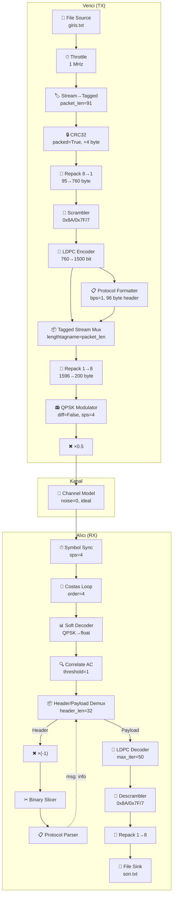

# Packet Communication Loopback Simülasyonu - Proje Durum Raporu

> **GNU Radio Companion Versiyonu:** 3.10.12.0  
> **Dosya:** `untitled.grc` / `untitled.py`  
> **Son Güncelleme:** 2026-04-23

---

## 1. Genel Bakış

QPSK modülasyonu ile **Scrambler** ve **LDPC** kanal kodlaması kullanan bir **paket haberleşme loopback simülasyonu**. Verici (TX) ve alıcı (RX) arasında fiziksel donanım kullanılmaz; sinyal bir **kanal modeli** bloğu üzerinden geçirilir. Giriş olarak `giris.txt` dosyasından metin okunur, paketlenir, kodlanır, modüle edilir, demodüle edilir, kodu çözülür ve `son.txt` dosyasına yazılır.

---

## 2. Değişkenler (Variables)

| Değişken | Değer | Açıklama |
|---|---|---|
| `samp_rate` | `1,000,000` (1 MHz) | Örnekleme hızı |
| `packet_len` | **`91`** byte | Her paketin boyutu (LDPC k=152 ile uyumlu: (91+4)×8=760=5×152) |
| `qpsk` | `constellation_rect` | QPSK: noktalar `[-1-1j, -1+1j, 1+1j, 1-1j]`, symbol map `[0, 1, 3, 2]` (Gray kodlu) |
| `hdr_format` | `header_format_default` | 64-bit erişim kodu, **`bps=1`**, `threshold=0` |
| `ldpc_enc_def` | `ldpc_encoder` | LDPC kodlayıcı — `n_0300_k_0152_gap_03.alist`, dim1=1 |
| `ldpc_dec_def` | `ldpc_decoder` | LDPC kod çözücü — aynı matris, `max_iter=50`, dim1=4 |

### Erişim Kodu (Access Code)
```
1010101011110000101010101111000010101010111100001010101011110000
```
64-bit, `hdr_format` ve `correlate_access_code` bloklarında aynı.

---

## 3. LDPC Matrisi

**Dosya:** `n_0300_k_0152_gap_03.alist`

| Parametre | Değer |
|---|---|
| Kod uzunluğu (n) | 300 |
| Bilgi uzunluğu (k) | 152 |
| Kod oranı (R) | 0.507 |
| Format | AList (seyrek matris) |

### Paket/LDPC Uyumu
```
packet_len = 91 byte
CRC sonrası = 95 packed byte
Unpack sonrası = 760 bit
760 ÷ 152 = 5 codeword (TAM BÖLÜNÜR ✓)
FEC çıkış = 5 × 300 = 1500 bit
```

---

## 4. Sinyal Akış Şeması (Flowgraph)

### 4.1. Verici (TX) Pipeline

```
File Source (giris.txt)
    │  byte stream, repeat=True
    ▼
Throttle (1 MHz)
    │
    ▼
Stream to Tagged Stream
    │  packet_len=91, tag="packet_len"
    ▼
CRC32 (ekleme, packed=True)
    │  +4 byte CRC → 95 packed byte/paket, tag=95
    ▼
Repack Bits (8→1)                    ← EKLENDİ
    │  95 packed → 760 unpacked byte
    │  len_tag_key="packet_len", tag=760
    ▼
Scrambler
    │  mask=0x8A, seed=0x7F, len=7
    │  760 unpacked byte (bit-level XOR)
    ▼
FEC Extended Encoder (LDPC)
    │  puncpat='11', capillary threading
    │  760 bit → 5 codeword → 1500 bit
    │
    ├──────────────────────────────────────┐
    │                                      │
    ▼                                      ▼
Protocol Formatter                    (payload data)
    │  hdr_format (bps=1)                  │
    │  Access code (64 bit) +              │
    │  Header data (32 bit) =              │
    │  96 unpacked byte                    │
    ▼                                      │
Tagged Stream Mux  ◄───────────────────────┘
    │  lengthtagname="packet_len"
    │  [header(96) | payload(1500)] = 1596 byte
    ▼
Repack Bits (1→8)                    ← EKLENDİ
    │  1596 unpacked → 199.5 → 200 packed byte
    │  len_tag_key="packet_len"
    ▼
Constellation Modulator (QPSK)
    │  differential=False, sps=4, excess_bw=0.35
    ▼
Multiply Const (×0.5)
    │  güç ayarı
    ▼
Channel Model
    │  noise=0.0, freq_offset=0.0
    │  epsilon=1.0, taps=[1.0], block_tags=False
    ▼
Virtual Sink  →→→  Virtual Source
```

### 4.2. Alıcı (RX) Pipeline

```
Virtual Source
    │  complex samples
    ▼
Symbol Sync (Polyphase Clock Recovery)
    │  TED: SIGNAL_TIMES_SLOPE_ML
    │  sps=4, loop_bw=0.045
    │  nfilters=128, IR_MMSE_8TAP
    ▼
Costas Loop (4th order)
    │  loop_bw=0.0628 (2π/100)
    │  QPSK faz kurtarma
    ▼
Constellation Soft Decoder
    │  QPSK → float soft bits
    ▼
Correlate Access Code (Float TS)
    │  64-bit access code, threshold=1
    │  tagname="packet_len"
    ▼
Header/Payload Demux
    │  header_len=32, items_per_symbol=1
    │  type=float, trigger_tag_key="packet_len"
    │
    ├── Port 0 (Header) ──────────────────┐
    │                                      ▼
    │                    Multiply Const (×-1.0)
    │                                      │
    │                                      ▼
    │                           Binary Slicer (float→byte)
    │                                      │
    │                                      ▼
    │                           Protocol Parser
    │                                      │
    │                                  msg "info"
    │                                      │
    │                           ◄──────────┘
    │                     (header_data feedback)
    │
    └── Port 1 (Payload)
         │  float soft bits (1500 items)
         ▼
    FEC Extended Decoder (LDPC)
         │  max_iter=50, capillary
         │  1500 → 760 decoded bits
         ▼
    Descrambler
         │  mask=0x8A, seed=0x7F, len=7
         ▼
    Repack Bits (1→8)
         │  len_tag_key="packet_len"
         │  760 unpacked → 95 packed byte
         ▼
    File Sink (son.txt)
```

---

## 5. Blok Detayları

### 5.1. Verici Blokları

| Blok | Tip | Kritik Parametreler |
|---|---|---|
| `blocks_file_source_0` | File Source | `giris.txt`, byte, repeat=True |
| `blocks_throttle2_0` | Throttle | 1 MHz, ignore tag=True |
| `blocks_stream_to_tagged_stream_0` | Stream→Tagged | len=91, key="packet_len" |
| `digital_crc32_bb_0` | CRC32 | check=False (ekleme), **packed=True** |
| `blocks_repack_bits_bb_0_0_0` | **Repack Bits** | **k=8, l=1**, len_tag_key="packet_len" |
| `digital_scrambler_bb_0` | Scrambler | mask=0x8A, seed=0x7F, len=7 |
| `fec_extended_encoder_0` | LDPC Encoder | capillary threading, puncpat='11' |
| `digital_protocol_formatter_bb_0` | **Protocol Formatter** | hdr_format (bps=1), len_tag_key="packet_len" |
| `blocks_tagged_stream_mux_0` | Mux | **lengthtagname="packet_len"**, ninputs=2 |
| `blocks_repack_bits_bb_0_0` | **Repack Bits** | **k=1, l=8**, len_tag_key="packet_len" |
| `digital_constellation_modulator_0` | QPSK Mod | diff=False, sps=4, bw=0.35 |
| `blocks_multiply_const_vxx_0` | Gain | ×0.5 |

### 5.2. Kanal

| Blok | Tip | Kritik Parametreler |
|---|---|---|
| `channels_channel_model_0` | Channel Model | noise=0, freq=0, eps=1.0, taps=[1.0], block_tags=False |

### 5.3. Alıcı Blokları

| Blok | Tip | Kritik Parametreler |
|---|---|---|
| `digital_symbol_sync_xx_0` | Symbol Sync | CC, TED_SIGNAL_TIMES_SLOPE_ML, sps=4 |
| `digital_costas_loop_cc_0` | Costas Loop | order=4 (QPSK), bw=0.0628 |
| `digital_constellation_soft_decoder_cf_0` | Soft Decoder | QPSK, npwr=-1 |
| `digital_correlate_access_code_xx_ts_0` | Correlate AC | float, threshold=1, tagname=packet_len |
| `digital_header_payload_demux_0` | HPD | **header_len=32**, items_per_symbol=1, float |
| `blocks_multiply_const_vxx_1` | Multiply Const | **×(-1.0)** (soft bit polarite düzeltme) |
| `digital_binary_slicer_fb_0` | Binary Slicer | float→byte |
| `digital_protocol_parser_b_0` | Protocol Parser | hdr_format |
| `fec_extended_decoder_0` | LDPC Decoder | max_iter=50, capillary |
| `digital_descrambler_bb_0` | Descrambler | mask=0x8A, seed=0x7F, len=7 |
| `blocks_repack_bits_bb_0` | Repack Bits | k=1, l=8, **len_tag_key="packet_len"** |
| `blocks_file_sink_0` | File Sink | `son.txt`, byte |

---

## 6. Bağlantılar (Connections)

### TX Zinciri
```
file_source → throttle → stream_to_tagged → crc32
  → repack(8→1) → scrambler → fec_encoder
  → protocol_formatter → tagged_stream_mux (input 0)
  → fec_encoder → tagged_stream_mux (input 1)
  → tagged_stream_mux → repack(1→8) → constellation_modulator
  → multiply_const(×0.5) → channel_model → virtual_sink
```

### RX Zinciri
```
virtual_source → symbol_sync → costas_loop → soft_decoder
  → correlate_access_code → header_payload_demux
  → (port 0) multiply_const(×-1) → binary_slicer → protocol_parser → msg→demux
  → (port 1) fec_decoder → descrambler → repack(1→8) → file_sink
```

---

## 7. Debug Görselleştirme Blokları

| Blok | Bağlantı Noktası | Görselleştirme |
|---|---|---|
| `qtgui_time_sink_x_0_0_0` | Soft decoder çıkışı | "correlate access code giriş" |
| `qtgui_time_sink_x_0_0` | Correlate AC çıkışı | "correlate access code çıkış" |
| `qtgui_time_sink_x_0` | HPD payload çıkışı | "demux çıkış" |
| `qtgui_sink_x_0` | Costas Loop çıkışı | Frekans/Zaman/Constellation |

---

## 8. Yapılan Değişiklikler (Changelog)

### Oturumda yapılan düzeltmeler (2026-04-23):

| # | Değişiklik | Önceki | Yeni | Neden |
|---|---|---|---|---|
| 1 | CRC32 packed | False | **True** | Girdi packed byte, CRC packed olarak işlemeli |
| 2 | Repack (8→1) eklendi | — | **blocks_repack_bits_bb_0_0_0** | CRC32 packed çıkışı → Scrambler unpacked girişi dönüşümü |
| 3 | Repack (1→8) eklendi | — | **blocks_repack_bits_bb_0_0** | Mux unpacked çıkışı → Modulator packed girişi dönüşümü |
| 4 | hdr_format bps | 1→2→**1** | **1** | Header ve payload aynı formatta (1 bit/byte) olmalı |
| 5 | header_payload_demux header_len | 32→16→**32** | **32** | bps=1 ile header 32 bit = 32 float item |
| 6 | Tüm Repack blokları len_tag_key | `""` | **`"packet_len"`** | Tagged stream tag'larının propagasyonu için zorunlu |
| 7 | packet_len | 96 | **91** | (91+4)×8=760=5×152 → LDPC k=152 ile tam bölünür |
| 8 | tagged_stream_mux lengthtagname | `""` | **`"packet_len"`** | Mux'un paket sınırlarını tanıması için zorunlu |
| 9 | packet_headergenerator | Silindi | **protocol_formatter_bb** | Yeni header formatter bloğu |
| 10 | Multiply Const (×-1) | — | Header path'e eklendi | Soft bit polarite düzeltme |

---

## 9. Giriş/Çıkış Dosyaları

| Dosya | Boyut | Açıklama |
|---|---|---|
| `giris.txt` | 67,886 byte | Lorem ipsum metin (225 satır) |
| `son.txt` | Henüz test edilmedi | Demodüle/decode edilen çıkış |
| `n_0300_k_0152_gap_03.alist` | 7,498 byte | LDPC parity-check matrisi |

---

## 10. Paket Boyut Hesabı

```
packet_len = 91 byte
  │
  ▼ CRC32 (+4 byte)
95 packed byte (tag=95)
  │
  ▼ Repack (8→1)
760 unpacked byte (tag=760)
  │
  ▼ Scrambler (uzunluk değişmez)
760 unpacked byte
  │
  ▼ LDPC Encoder (k=152, n=300)
5 codeword × 300 = 1500 unpacked byte (tag=1500)
  │
  ├─→ Protocol Formatter: 64 AC + 32 header = 96 byte header
  │
  ▼ Tagged Stream Mux
96 + 1500 = 1596 unpacked byte
  │
  ▼ Repack (1→8)
1596/8 = 199.5 → 200 packed byte
  │
  ▼ QPSK Modulator (2 bit/symbol, sps=4)
200 × 8 / 2 = 800 QPSK symbol × 4 = 3200 complex sample
  │
  ▼ ×0.5 → Channel → RX
```

---

## 11. Mermaid Diagram — Güncel Sinyal Akışı



---

## 12. Bilinen Sorunlar / İzlenmesi Gerekenler

### 12.1. Costas Loop Faz Belirsizliği
- `differential=False` → Costas Loop 4 farklı fazda kilitlenebilir (0°, 90°, 180°, 270°)
- İdeal kanalda (noise=0) sorun olmamalı ama gürültü eklenince risk oluşur
- Çözüm: differential encoding veya pilot sembolleri

### 12.2. Channel Model block_tags=False
- TX tarafı tag'ları RX'e sızıyor
- `correlate_access_code` yanlış tag'larla karışabilir
- Potansiyel çözüm: `block_tags=True` yap

### 12.3. Scrambler State Senkronizasyonu
- `digital_scrambler_bb` stream modunda çalışır, paket sınırlarında state sıfırlanmaz
- Potansiyel desenkronizasyon riski

### 12.4. RX Tarafı CRC Kontrolü
- TX'te CRC ekleniyor ama RX'te CRC kontrol bloğu yok
- `son.txt`'de CRC byte'ları da veri olarak yazılıyor (4 ekstra byte/paket)

---

## 13. Sonraki Adımlar

1. **Simülasyonu çalıştır** — hata mesajlarını kontrol et
2. **`son.txt` vs `giris.txt` karşılaştır** — byte-level diff
3. **BER testi** — gürültüsüz ortamda BER=0 olmalı
4. **Gürültü ekleme** — `noise_voltage` > 0 ile performans testi
5. **Frekans/zamanlama ofset testi** — gerçekçi kanal koşulları

---

*Bu döküman, `untitled.grc` flowgraph dosyasının güncel analizi ile oluşturulmuştur.*
