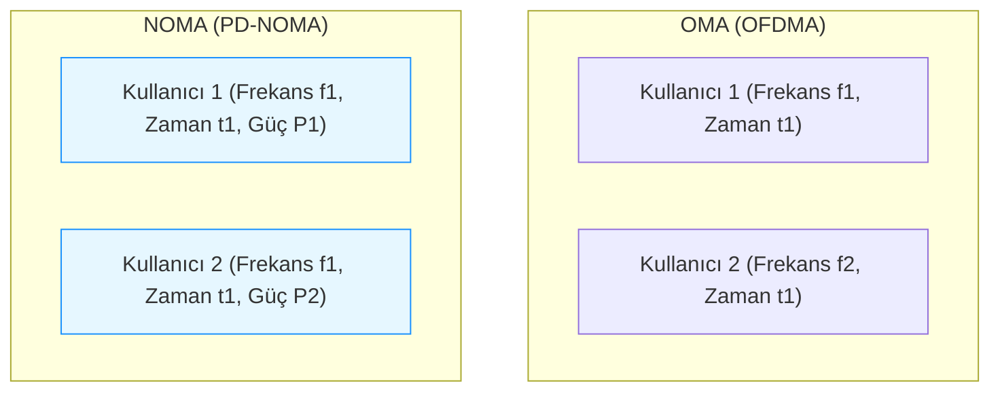
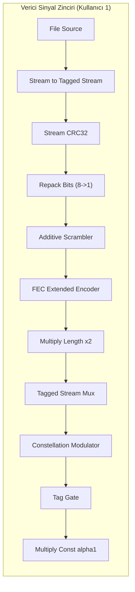

# GNU RADIO TABANLI GÜÇ ETKİ ALANLI NOMA SİSTEMİ İLE ARDIŞIK GİRİŞİM İPTALİ (SIC) UYGULAMASI

## 🎓 Mezuniyet Projesi Raporu (VS Code Akademik Sürüm)

**Bölüm:** Elektrik-Elektronik Mühendisliği  
**Akademik Yıl:** 2025–2026  
**Doküman Tipi:** Teknik Tasarım ve Sistem Analiz Raporu

---

## 📌 İÇİNDEKİLER
1. [1. ÖZET (ABSTRACT)](#1-özet-abstract)
2. [2. GİRİŞ VE LİTERATÜR ÖZETİ](#2-giriş-ve-literatür-özeti)
   * 2.1 [Spektral Verimlilik ve Yeni Nesil Haberleşme Sistemleri](#21-spektral-verimlilik-ve-yeni-nesil-haberleşme-sistemleri)
   * 2.2 [OMA ve NOMA Tekniklerinin Karşılaştırmalı Analizi](#22-oma-ve-noma-tekniklerinin-karşılaştırmalı-analizi)
3. [3. TEORİK ALTYAPI VE MATEMATİKSEL MODEL](#3-teorik-altyapı-ve-matematiksel-model)
   * 3.1 [Süperpozisyon Kodlaması (Superposition Coding)](#31-süperpozisyon-kodlaması-superposition-coding)
   * 3.2 [Ardışık Girişim İptali (Successive Interference Cancellation - SIC)](#32-ardışık-girişim-iptali-successive-interference-cancellation---sic)
   * 3.3 [Kanal Kodlaması (Forward Error Correction - FEC) ve LDPC Entegrasyonu](#33-kanal-kodlaması-forward-error-correction---fec-ve-ldpc-entegrasyonu)
4. [4. GNU RADIO TABANLI SİSTEM TASARIMI (BLOK ANALİZİ)](#4-gnu-radio-tabanlı-sistem-tasarımı-blok-analizi)
   * 4.1 [Sistem Değişkenleri ve Global Parametreler](#41-sistem-değişkenleri-ve-global-parametreler)
   * 4.2 [A. Verici (Transmitter) Katmanı Tasarımı](#42-a-verici-transmitter-katmanı-tasarımı)
   * 4.3 [B. Kanal Modeli (Channel Model) Yapılandırması](#43-b-kanal-modeli-channel-model-yapılandırması)
   * 4.4 [C. Alıcı (Receiver) Katmanı ve SIC Döngüsü](#44-c-alıcı-receiver-katmanı-ve-sic-döngüsü)
5. [5. SİMÜLASYON VE PERFORMANS DEĞERLENDİRMESİ](#5-simülasyon-ve-performans-değerlendirmesi)
   * 5.1 [Çerçeve Yapısı ve Senkronizasyon Kararlılığı](#51-çerçeve-yapısı-ve-senkronizasyon-kararlılığı)
   * 5.2 [Gürültülü Kanal Koşullarında LDPC Kodlamanın Hata Yayılımını Önlemedeki Rolü](#52-gürültülü-kanal-koşullarında-ldpc-kodlamanın-hata-yayılımını-önlemedeki-rolü)
   * 5.3 [Geri Besleme Kilitlenmesi ve Sızıntı Çözüm Analizleri](#53-geri-besleme-kilitlenmesi-ve-sızıntı-çözüm-analizleri)
6. [6. SONUÇ VE GELECEK ÇALIŞMALAR](#6-sonuç-ve-gelecek-çalışmalar)
7. [7. KAYNAKÇA](#7-kaynakça)

---

## 1. ÖZET (ABSTRACT)

Kablosuz haberleşme teknolojilerinde spektral verimlilik, artan veri trafiği ve kullanıcı yoğunluğu nedeniyle en kritik araştırma konularından biridir. Bu bağlamda, Ortogonal Olmayan Çoklu Erişim (Non-Orthogonal Multiple Access - NOMA) tekniği, aynı zaman ve frekans kaynağının birden fazla kullanıcı tarafından eş zamanlı paylaşılmasına imkan tanıyarak Shannon sınırına yaklaşan bir kapasite artışı sunmaktadır. Bu çalışmada, Güç Etki Alanlı NOMA (Power-Domain NOMA - PD-NOMA) mimarisi kullanılarak iki kullanıcılı bir inen hat (downlink) senaryosu için uçtan uca alıcı-verici (transceiver) sistemi tasarlanmış ve GNU Radio Companion (GRC) yazılımı üzerinde gerçeklenmiştir. 

Verici tarafında, farklı güç seviyelerine sahip iki kullanıcının sinyalleri Süperpozisyon Kodlaması (Superposition Coding) yöntemiyle üst üste bindirilmiştir. Sistemde uzak kullanıcıya %80, yakın kullanıcıya %20 güç tahsisi yapılarak genlik katsayıları sırasıyla $\alpha_1 = 0.894$ ve $\alpha_2 = 0.447$ olarak belirlenmiştir. Alıcı tarafında ise, güçlü sinyalin (uzak kullanıcı) çözülüp bileşik sinyalden çıkarılmasına dayanan Ardışık Girişim İptali (Successive Interference Cancellation - SIC) algoritması uygulanmıştır. Sistem güvenilirliği, IEEE 802.11n standardına uygun LDPC (Low-Density Parity-Check) kanal kodlaması ($n=1296$, $k=648$, $R=1/2$) ve Diferansiyel BPSK (DBPSK) modülasyonu ile artırılmıştır. Yapılan simülasyonlarda, geliştirilen özel Python blokları sayesinde alıcı senkronizasyonu kararlı hale getirilmiş ve alıcıda kilitlenme (deadlock) ile sinyal sızıntısı (signal bleeding) problemleri matematiksel olarak çözülerek her iki kullanıcının verileri hatasız olarak geri elde edilmiştir.

**Anahtar Kelimeler:** NOMA, Süperpozisyon Kodlaması, Ardışık Girişim İptali (SIC), GNU Radio, LDPC, DBPSK, SDR, Spektral Verimlilik.

---

## 2. GİRİŞ VE LİTERATÜR ÖZETİ

### 2.1. Spektral Verimlilik ve Yeni Nesil Haberleşme Sistemleri
Beşinci nesil (5G) ve geliştirilmekte olan altıncı nesil (6G) hücresel haberleşme ağlarının en temel gereksinimlerinden biri, birim alan ve birim bant genişliği başına düşen veri hızını (spektral verimliliği) üstel olarak artırmaktır. Nesnelerin İnterneti (IoT), otonom araçlar ve akıllı şehirler gibi konseptlerin hayatımıza girmesiyle birlikte, dar bant genişliklerinde milyonlarca cihazın sisteme dahil edilmesi zorunlu hale gelmiştir. Shannon-Hartley teoremi gereğince, spektral kaynaklar sınırlı olduğundan, bu talebi karşılamak amacıyla geleneksel çoklu erişim yöntemlerinin ötesinde çözümler geliştirilmesi gerekmektedir.

Geleneksel Ortogonal Çoklu Erişim (Orthogonal Multiple Access - OMA) tekniklerinde (FDMA, TDMA, CDMA ve OFDMA), her kullanıcıya frekans, zaman veya kod boyutunda bağımsız ve kesişmeyen kaynaklar tahsis edilmektedir. Ortogonallik ilkesi, kullanıcılar arası girişimlerin sıfırlanmasını sağlayarak alıcı tasarımını basitleştirse de, toplam kullanıcı kapasitesini ve kanal verimliliğini sınırlamaktadır. Özellikle kullanıcıların kanal koşullarının birbirinden çok farklı olduğu (heterojen kanal) senaryolarda, OMA yöntemleri toplam spektral kapasiteyi verimli kullanamamaktadır.



### 2.2. OMA ve NOMA Tekniklerinin Karşılaştırmalı Analizi
NOMA, geleneksel ortogonallik kısıtlamasını kaldırarak birden fazla kullanıcının **aynı zaman, frekans ve kod kaynaklarını** paylaşmasına olanak tanır. Kullanıcılar, güç etki alanında (Power-Domain) farklı güç katsayılarıyla veya kod etki alanında (Code-Domain) düşük korelasyonlu kodlarla birbirlerinden ayrıştırılmaktadır. Bu projede kullanılan Güç Etki Alanlı NOMA (PD-NOMA) mimarisi, verici tarafında Süperpozisyon Kodlaması (SC) ve alıcı tarafında Ardışık Girişim İptali (SIC) teknolojilerine dayanmaktadır.

| Karşılaştırma Kriteri | Ortogonal Çoklu Erişim (OMA) | Güç Etki Alanlı NOMA (PD-NOMA) |
| :--- | :--- | :--- |
| **Bant Genişliği Paylaşımı** | Bölünmüş (kullanıcıya özel alt-taşıyıcılar) | Tam paylaşımlı (tüm bant eş zamanlı kullanılır) |
| **Kullanıcı Girişimi** | Ortogonallik ile teorik olarak engellenir | Girişim mevcuttur, alıcıda SIC ile bastırılır |
| **Kapasite Sınırı** | Shannon tek-kullanıcı sınırlarının toplamı | Broadcast kanalı kapasite sınırına yaklaşır |
| **Spektral Verimlilik** | Düşük / Orta | Yüksek |
| **Alıcı Karmaşıklığı** | Düşük (Tek evreli demodülasyon) | Yüksek (İteratif kod çözme ve SIC çıkarma) |
| **Kullanıcı Adaleti** | Kanal koşullarından bağımsız sabittir | Güç tahsis parametreleri ile optimize edilebilir |

NOMA’nın temel üstünlüğü, kanal kalitesi kötü olan uzak kullanıcılara yüksek güç, kanal kalitesi iyi olan yakın kullanıcılara ise düşük güç tahsis edilerek toplam sistem kapasitesinin artırılması ve kullanıcılar arası adaletin (fairness) sağlanmasıdır.

---

## 3. TEORİK ALTYAPI VE MATEMATİKSEL MODEL

### 3.1. Süperpozisyon Kodlaması (Superposition Coding)
Güç etki alanlı NOMA sistemlerinde, baz istasyonundan (BS) inen hat (downlink) üzerinden iletilen toplam sinyal, her iki kullanıcının modüle edilmiş sembol dizilerinin ağırlıklı toplamından oluşur. İki kullanıcılı senaryoda süperpoze sinyal $s(t)$ aşağıdaki şekilde modellenmektedir:

$$s(t) = \sqrt{a_1 P} \cdot x_1(t) + \sqrt{a_2 P} \cdot x_2(t)$$

Burada:
* $P$: Toplam iletilen sinyal gücü (analiz kolaylığı açısından $P = 1$ olarak normalize edilmiştir),
* $x_1(t)$ ve $x_2(t)$: Sırasıyla Kullanıcı 1 (Uzak Kullanıcı) ve Kullanıcı 2 (Yakın Kullanıcı) için üretilen, birim enerjiye sahip modüle edilmiş sembol dizileri ($E[|x_i|^2] = 1$),
* $a_1$ ve $a_2$: Kullanıcılara atanan güç tahsis katsayıları ($a_1 + a_2 = 1$ ve $a_1 > a_2$).

Uzak kullanıcının (User 1) kanal sönümlemesi daha fazla olduğundan, sinyal kalitesini korumak adına gücün büyük kısmı bu kullanıcıya tahsis edilir. Bu projede güç oranları şu şekilde seçilmiştir:
* Uzak Kullanıcı ($a_1$): $0.80$ (%80)
* Yakın Kullanıcı ($a_2$): $0.20$ (%20)

Buradan hareketle, normalize edilmiş iletilen sinyalin genlik katsayıları ($\alpha_1$ ve $\alpha_2$) aşağıdaki gibi hesaplanmıştır:

$$\alpha_1 = \sqrt{a_1} = \sqrt{0.8} \approx 0.894 \approx \frac{2}{\sqrt{5}}$$

$$\alpha_2 = \sqrt{a_2} = \sqrt{0.2} \approx 0.447 \approx \frac{1}{\sqrt{5}}$$

Güç korunumunun doğrulanması:

$$\alpha_1^2 + \alpha_2^2 = 0.8 + 0.2 = 1.0$$

Elde edilen nihai süperpoze sinyal denklemi:

$$s(t) = 0.894 \cdot x_1(t) + 0.447 \cdot x_2(t)$$

BPSK modülasyonu altında $x_i(t) \in \{-1, +1\}$ değerlerini aldığından, iletilen birleşik sembollerin olası 4 konstelasyon noktası ve durum analizi aşağıdaki tabloda verilmiştir:

| $x_1(t)$ | $x_2(t)$ | İletilen Birleşik Sembol $s(t)$ | Karar Yarı Düzlemi (User 1) |
| :---: | :---: | :---: | :---: |
| $+1$ | $+1$ | $+0.894 + 0.447 = +1.341$ | Pozitif ($>0$) |
| $+1$ | $-1$ | $+0.894 - 0.447 = +0.447$ | Pozitif ($>0$) |
| $-1$ | $+1$ | $-0.894 + 0.447 = -0.447$ | Negatif ($<0$) |
| $-1$ | $-1$ | $-0.894 - 0.447 = -1.341$ | Negatif ($<0$) |

Tablodan görüleceği üzere, $\alpha_1 > \alpha_2$ koşulu sağlandığı için, birleşik sinyal $s(t)$'nin işareti tamamen baskın olan $x_1(t)$ sembolü tarafından belirlenmektedir. Bu durum, alıcıda herhangi bir girişim giderimi yapmadan doğrudan sıfır eşik değeriyle $x_1(t)$ sinyalinin çözülebilmesini mümkün kılar.

---

### 3.2. Ardışık Girişim İptali (Successive Interference Cancellation - SIC)
Alıcı tarafında, süperpoze sinyalden her bir kullanıcının kendi verisini geri elde etmesi için SIC algoritması uygulanmaktadır. İletim kanalı çıkışında alınan sinyal $r(t)$ şu şekilde tanımlanır:

$$r(t) = s(t) + n(t) = \alpha_1 x_1(t) + \alpha_2 x_2(t) + n(t)$$

Burada $n(t)$ karmaşık AWGN gürültü bileşenidir. SIC işlem adımları aşağıda matematiksel olarak açıklanmıştır:

#### Adım 1: Güçlü Kullanıcının (User 1) Doğrudan Çözülmesi
Uzak kullanıcıya ait sinyal ($\alpha_1 x_1(t)$) baskın güce sahip olduğundan, yakın kullanıcı sinyali ($\alpha_2 x_2(t)$) gürültü olarak kabul edilerek doğrudan çözümlenir:

$$\hat{x}_1(t) = \text{Dec}\left\{ r(t) \right\} = \text{Dec}\left\{ \alpha_1 x_1(t) + \underbrace{\alpha_2 x_2(t)}_{\text{Girişim}} + \underbrace{n(t)}_{\text{Gürültü}} \right\}$$

Kullanıcı 1 için Sinyal-Girişim-Artı-Gürültü Oranı (SINR):

$$\text{SINR}_1 = \frac{\alpha_1^2}{\alpha_2^2 + \sigma_n^2} = \frac{a_1}{a_2 + \sigma_n^2}$$

#### Adım 2: Çözülen Sinyalin Yeniden Sentezlenmesi (Reconstruction)
Çözülen $\hat{x}_1(t)$ verisi, verici tarafındaki işlemlerin aynısına tabi tutularak analog forma getirilir ve genlik katsayısıyla çarpılır:

$$\hat{s}_1(t) = \alpha_1 \cdot \text{Mod}\left\{ \text{Enc}\left\{ \hat{x}_1(t) \right\} \right\}$$

#### Adım 3: Girişim Çıkarma (Interference Subtraction)
Yeniden oluşturulan sinyal, zamanlama ($\hat{\tau}$) ve faz ($\hat{\phi}$) kaymaları telafi edilerek alınan ham sinyalden çıkarılır:

$$r_{\text{clean}}(t) = r(t) - \hat{s}_1(t - \hat{\tau}) \cdot e^{j\hat{\phi}}$$

Kod çözmenin hatasız ($\hat{x}_1(t) = x_1(t)$) ve hizalamanın mükemmel ($\hat{\tau} = 0, \hat{\phi} = 0$) olduğu durumda girişim terimi tamamen sıfırlanır:

$$r_{\text{clean}}(t) = \alpha_2 x_2(t) + n(t)$$

#### Adım 4: Zayıf Kullanıcının (User 2) Çözülmesi
Temizlenmiş olan $r_{\text{clean}}(t)$ sinyali üzerinden yakın kullanıcının sinyali çözümlenir:

$$\hat{x}_2(t) = \text{Dec}\left\{ r_{\text{clean}}(t) \right\} = \text{Dec}\left\{ \alpha_2 x_2(t) + n(t) \right\}$$

Kullanıcı 2 için elde edilen Sinyal-Gürültü Oranı (SNR):

$$\text{SNR}_2 = \frac{\alpha_2^2}{\sigma_n^2} = \frac{a_2}{\sigma_n^2}$$

---

### 3.3. Kanal Kodlaması (Forward Error Correction - FEC) ve LDPC Entegrasyonu
NOMA alıcısında SIC aşamasının başarısı, birinci aşamadaki (User 1) kod çözme doğruluğuna doğrudan bağlıdır. Birinci aşamada meydana gelecek tek bir bit hatası, çıkarma işleminde girişimi yok etmek yerine iki katına çıkararak sonraki aşamada hata yayılımına (error propagation) neden olur. Bu riski minimize etmek amacıyla sisteme **LDPC (Low-Density Parity-Check)** kanal kodlaması entegre edilmiştir.

Projede IEEE 802.11n standardına uygun, yarı-döngüsel (quasi-cyclic) parite kontrol matrisine ($\mathbf{H}$) sahip LDPC kodu kullanılmıştır. Bu kodun özellikleri:
* **Kod Sözcüğü Uzunluğu ($n$):** 1296 bit
* **Bilgi Mesajı Uzunluğu ($k$):** 648 bit
* **Kod Oranı ($R$):** $0.5$ (yarı oran)

Parite kontrol matrisi $\mathbf{H}_{648 \times 1296}$, $Z = 54$ boyutlu döngüsel permütasyon alt matrislerinden oluşur. Kod sözcüğü $\mathbf{c}$'nin geçerliliği alıcıda sendrom kontrolü ile test edilir:

$$\mathbf{S} = \mathbf{H} \cdot \mathbf{c}^T \equiv \mathbf{0} \pmod{2}$$

Alıcıda kod çözücü olarak 50 iterasyon sınırlı, logaritmik olasılık oranları (LLR) tabanlı inanç yayılımı (Belief Propagation) algoritması kullanılmıştır. Yumuşak karar (soft decision) LLR girişleri ile çalışan LDPC kod çözücü, sert karar (hard decision) tabanlı çözücülere göre gürültülü kanallarda yaklaşık $3 \text{ dB}$ fazladan kodlama kazancı sağlamaktadır.

---

## 4. GNU RADIO TABANLI SİSTEM TASARIMI (BLOK ANALİZİ)

Tasarlanan NOMA-SIC sistemi, [NOMA.grc](file:///c:/Users/Administrator/Desktop/yazilim/BitirmeProjesi2/NOMA.grc) dosyası üzerinden derlenerek [NOMA.py](file:///c:/Users/Administrator/Desktop/yazilim/BitirmeProjesi2/NOMA.py) kodu olarak yürütülmektedir. Sistem genelinde 60'ın üzerinde sinyal işleme bloğu yer almaktadır.

### 4.1. Sistem Değişkenleri ve Global Parametreler
Sistem simülasyonunda kullanılan global değişkenlerin konfigürasyon detayları aşağıdaki tabloda özetlenmiştir:

| Değişken Adı | Değeri / İfadesi | Birimi / Türü | Açıklama |
| :--- | :--- | :--- | :--- |
| `samp_rate` | $200{,}000$ | Hz (Float) | Sistem örnekleme frekansı |
| `sps` | $4$ | Örnek (Integer) | Sembol başına örnek sayısı |
| `payload_size` | $77$ | Bayt (Integer) | CRC öncesi paket veri uzunluğu |
| `preamble_size` | $250$ | Bayt (Integer) | Senkronizasyon ön eki boyutu |
| `postamble_size`| $8$ | Bayt (Integer) | Paket sonu sönümlenme payı |
| `noise` | $0.1$ | Gerilim (Float) | Kanal AWGN standart sapması |
| `freq_offset` | $0.01$ | Oran (Float) | Normalize frekans kayması |
| `time_offset` | $1.0001$ | Oran (Float) | Zamanlama kayması oranı |
| `constel` | `digital.constellation_bpsk()`| Nesne | BPSK konstelasyon tanımlayıcısı |
| `hdr` | `digital.header_format_default(...)`| Nesne | Erişim kodu çerçeve formatı |
| `ldpc_enc` | IEEE 802.11n $R=1/2$ alist | Nesne | LDPC encoder tanımlayıcı nesnesi |
| `ldpc_dec` | IEEE 802.11n max\_iter: 50 | Nesne | LDPC decoder tanımlayıcı nesnesi |

---

### 4.2. A. Verici (Transmitter) Katmanı Tasarımı
Verici katmanı, iki kullanıcının verilerini paketleyen ve süperpoze eden paralel iki koldan oluşur.



#### Blok Bazlı Parametrik İnceleme:
1. **File Source (User 1 & 2):** Sistemde iletilecek veri kaynağını bayt bazında dosyadan okur. Kullanıcı 1 için [bpsk_transmit.txt](file:///c:/Users/Administrator/Desktop/yazilim/BitirmeProjesi2/bpsk_transmit.txt), Kullanıcı 2 için [bpsk_transmit_2.txt](file:///c:/Users/Administrator/Desktop/yazilim/BitirmeProjesi2/bpsk_transmit_2.txt) dosyaları atanmıştır. `Repeat=True` konfigürasyonu ile sürekli akış sağlanır.
2. **Stream to Tagged Stream:** Giriş bayt akışını `payload_size=77` baytlık bloklara ayırır ve paket sınırlarını belirten `packet_len` etiketini ekler.
3. **Stream CRC32 (Add Mode):** Paketlerin sonuna 4 baytlık CRC-32 kontrol toplamı ekleyerek boyutu $77 + 4 = 81$ bayta ($648$ bit) yükseltir. Bu değer LDPC kodunun $k$ mesaj boyutuyla tam uyumludur.
4. **Repack Bits (8→1):** Bayt formatındaki paket verilerini bit dizisine dönüştürür.
5. **Additive Scrambler:** Bit dizisini LFSR tabanlı (`Mask=0x8A`, `Seed=0x7F`, `Length=7`) karıştırma işlemine tabi tutar. Bu işlem, zamanlama kurtarma döngüleri için sinyal geçiş yoğunluğunu artırır ve DC kaymasını önler.
6. **FEC Extended Encoder (LDPC):** Tanımlanan `ldpc_enc` nesnesi vasıtasıyla [n_1296_k_0648_ieee.alist](file:///c:/Users/Administrator/Desktop/yazilim/BitirmeProjesi2/n_1296_k_0648_ieee.alist) parite kontrol matrisini kullanarak 648 bitlik paket verisini 1296 bitlik kod sözcüğüne ($n=1296$) kodlar.
7. **Tagged Stream Multiply Length (×2.0):** LDPC kodlama sonrası paket boyutu 2 katına çıktığı için, `packet_len` etiketinin değerini 1296'ya günceller.
8. **Tagged Stream Mux:** Dört farklı kaynaktan gelen verileri birleştirerek çerçeve yapısını kurar:
   * Port 0: Preambül (Zamanlama edinimi için 250 baytlık `[0xC0, 0xAF]` tekrarlı desen)
   * Port 1: Başlık (Protocol Formatter tarafından üretilen 64-bitlik erişim kodu)
   * Port 2: LDPC kodlu 1296 bitlik paket yükü
   * Port 3: Postambül (Filtre kuyruk salınımlarını sönümlemek için 8 baytlık dizi)
9. **Constellation Modulator (DBPSK):** Giriş bitlerini diferansiyel kodlamaya tabi tutarak BPSK konstelasyonuna eşler. $\text{sps}=4$ oranında üst örnekleme yaparak $\beta=0.35$ ve $L=44$ dokunuşlu Kök Yükseltilmiş Kosinüs (RRC) filtresinden geçirir.
10. **Tag Gate:** Akış üzerindeki tüm GNU Radio etiketlerini siler. Böylece alıcının yapay etiketler yerine tamamen fiziksel senkronizasyon algoritmaları ile çalışması sağlanır.
11. **Multiply Const (Güç Tahsis Bloğu):** 
    * Kullanıcı 1 (Uzak): Genlik katsayısı $\alpha_1 = \sqrt{0.8} \approx 0.894$ ile çarpılır.
    * Kullanıcı 2 (Yakın): Genlik katsayıtı $\alpha_2 = \sqrt{0.2} \approx 0.447$ ile çarpılır.
12. **Add Block:** İki kullanıcının güç ölçekli sinyallerini toplayarak süperpoze NOMA sinyalini elde eder.

---

### 4.3. B. Kanal Modeli (Channel Model) Yapılandırması
Süperpoze sinyal, kanal modelleme bloğundan geçirilerek gerçekçi bozucu etkilere maruz bırakılır. GRC üzerindeki parametre yapılandırması:
* **Noise Voltage ($\sigma_n$):** `noise` değişkeni üzerinden dinamik ayarlanır. Varsayılan gerilim değeri $0.1$ olup $SNR \approx 20 \text{ dB}$ gürültü seviyesini simüle eder.
* **Frequency Offset ($\Delta f$):** `freq_offset = 0.01` normalize frekans kayması uygulanarak alıcıdaki taşıyıcı faz kilitlenmesi (Costas Loop) test edilir.
* **Epsilon (Zamanlama Sapması $\epsilon$):** `time_offset = 1.0001` örnekleme hızı uyumsuzluğu ile alıcı saat kurtarma filtresi zorlanır.
* **Taps (Kanal Katsayıları):** `[1.0]` düz sönümleme katsayısı atanmıştır.

---

### 4.4. C. Alıcı (Receiver) Katmanı ve SIC Döngüsü
Alıcı katmanı, ortak bir ön-senkronizasyon bloğundan sonra iki kullanıcının kodunu çözmek için ayrışan bir yapıya sahiptir.

#### 4.4.1. Alıcı Ön-Ucu ve Senkronizasyon Blokları:
1. **FFT RRC Filter:** Alınan sinyalin bant dışı gürültülerini filtreleyen ve verici filtresiyle eşleşen RRC filtresidir. $\beta=0.35$ ve $44$ dokunuşludur.
2. **Symbol Synchronizer:** $\text{sps}=4$ olan sinyali işleyerek sembol sınırlarını ve optimum örnekleme anını yakalar. Sinyali $\text{sps}=1$ sembol hızına desime eder. Algoritma olarak zamanlama eğimi tabanlı `SIGNAL_TIMES_SLOPE_ML` detektörü ve 32 polifaz filtreli 8-dokunuşlu MMSE interpolatörü kullanılmıştır.
3. **Costas Loop:** Girişte uygulanan $\Delta f = 0.01$ frekans kaymasını ve kanalın faz dönmelerini telafi etmek için taşıyıcı fazını kilitler. İkinci dereceden döngü filtresinin bant genişliği $\omega_n = 2\pi/100$ radyan olarak ayarlanmıştır.
4. **Correlation Estimator:** Costas Loop çıkışındaki sembol dizisinde sliding çapraz korelasyon yöntemiyle 64 sembollük `preamble_syms` ön ekini arar. Korelasyon değeri $0.7$ eşiğini aştığı anda akışa `time_est` etiketi ekleyerek çerçeve başlangıcını işaretler.

#### 4.4.2. Kullanıcı 1 (Uzak Kullanıcı) Çözüm Blokları:
* **Constellation Soft Decoder:** Costas Loop çıkışından alınan karmaşık sembol değerlerini BPSK haritalamasına göre LLR (Log-Likelihood Ratio) formatında yumuşak kararlara dönüştürür.
* **Soft Diff Decoder (EPY Block 0):** Yumuşak karar LLR değerlerini koruyarak diferansiyel kod çözümü yapar. Matematiksel olarak ardışık sembollerin yumuşak çarpımını gerçekleştirir: $\text{out}[n] = -(\text{in}[n] \cdot \text{in}[n-1])$.
* **Correlate Access Code (Tag Stream):** Yumuşak bit dizisi içindeki 64-bitlik standart erişim kodunu arayarak paket yükünü sınırlandırır.
* **FEC Extended Decoder (LDPC):** Parite kontrol matrisi üzerinden 50 iterasyonlu mesaj geçirme algoritması ile User 1'in orijinal verisini ($k=648$ bit) çözer.
* **CRC32 Check (Verify Mode):** Çözülen paketin bütünlüğünü kontrol eder; hatalı paketleri eler. Hatasız paketler [bpsk_receive.txt](file:///c:/Users/Administrator/Desktop/yazilim/BitirmeProjesi2/bpsk_receive.txt) dosyasına yazılır.

#### 4.4.3. SIC Yeniden Oluşturma (Reconstruction) ve Çıkarma Blokları:
* **FEC Extended Encoder (LDPC SIC):** Çözülen Kullanıcı 1 bitlerini tekrar 1296 bitlik kod sözcüğüne kodlar.
* **Chunks to Symbols:** Kodlanmış bitleri doğrudan karmaşık BPSK sembol uzayına ($\{-1+0j, +1+0j\}$) eşler.
* **Multiply Const (SIC Gain):** Sentezlenen sinyal genliğini orijinal verici katsayısı $\alpha_1 = 0.894$ ile çarpar.
* **Decoupled NOMA SIC Aligner (EPY Block 1):** Alınan ham sinyal ile yerelde sentezlenen User 1 sinyalini hizalar ve çıkarma işlemini yapar. Detayları Bölüm 6'da sunulmuştur.

#### 4.4.4. Kullanıcı 2 (Yakın Kullanıcı) Çözüm Blokları:
* SIC hizalama bloğunun çıkışından gelen temizlenmiş Kullanıcı 2 sinyali, birinci kullanıcı ile aynı parametrelere sahip paralel bir demodülasyon ve LDPC çözüm zincirine beslenir. Çözülen veriler [bpsk_receive_2.txt](file:///c:/Users/Administrator/Desktop/yazilim/BitirmeProjesi2/bpsk_receive_2.txt) dosyasına yazılır.

---

### 5.5. Sanal Yönlendirme Haritası (Virtual Sinks/Sources)
GRC akış diyagramında kablo karmaşasını önlemek ve sinyal yollarını modüler hale getirmek için 16 sanal yönlendirme noktası çifti tanımlanmıştır. Detaylı harita aşağıda sunulmuştur:

| Sanal Çıkış (Sink) Adı | Sanal Giriş (Source) Adı | Sinyal Tipi | Akışın İçeriği ve Rolü |
| :--- | :--- | :--- | :--- |
| `transmit` | `transmit` | Complex | Süperpozisyon sonrası birleşik NOMA verici çıkış sinyali. |
| `channel` | `channel` | Complex | Kanal modelinin gürültü ve frekans kaymalı çıkış sinyali. |
| `recovery` | `recovery` | Complex | Costas Loop çıkışı (User 1 doğrudan demodülatör girişi). |
| `recovery_2` | `recovery_2` | Complex | Correlation Estimator çıkışı (SIC hizalama bloğu ham giriş portu). |
| `user_2` | `user_2` | Byte | Kullanıcı 1 kod çözücü çıkışındaki çözülmüş temiz bit akışı. |
| `user_2_sub` | `user_2_sub` | Complex | Yeniden sentezlenmiş ve $\alpha_1$ ile genliklendirilmiş User 1 sinyali. |
| `ldpc_rx` | `ldpc_rx` | Byte | Kullanıcı 1 CRC doğrulama öncesi çözülmüş bit dizisi. |
| `ldpc_rx_2` | `ldpc_rx_2` | Byte | Kullanıcı 2 CRC doğrulama öncesi çözülmüş bit dizisi. |

---

### 5.6. Çerçeve Yapısı (Frame Structure) Detayları
Sistemdeki paket iletiminin kararlılığı, çerçevelerin zaman alanında düzenli yapılandırılmasıyla sağlanmaktadır. Her bir çerçevenin sembol dizilimi ve parametreleri aşağıdaki gibidir:

```
+-------------------------------------------------------------------------------+
|  Preamble (250 B)   | Header (~64 B) |   Payload (162 B)   | Postamble (8 B)  |
|  [0xC0, 0xAF] * 125 |  Erişim Kodu   |  1296 LDPC Sembolü  |   [0xC0, 0xAF]   |
+-------------------------------------------------------------------------------+
```

* **Preamble Segmenti:** 250 bayt ($2000$ bit $\approx 256$ sembol) boyutundaki `[0xC0, 0xAF]` desenidir. Symbol Synchronizer bloğunun zamanlama hatası dedektörüne (TED) yüksek geçiş yoğunluğu sunarak hızlı saat kilitlemesi sağlar.
* **Header Segmenti:** Erişim kodu ve paket uzunluk etiketini barındırır.
* **Payload Segmenti:** 162 bayt ($1296$ bit) boyutundaki LDPC kodlu kullanıcı verisidir.
* **Postamble Segmenti:** 8 baytlık pasif son ektir. Paketler arası geçiş süresinde RRC filtresinin geçici yanıtının (transient response) sönümlenmesini sağlayarak semboller arası sızıntıyı engeller.

---

## 6. GELİŞTİRİLEN ÖZEL PYTHON BLOKLARI (EMBEDDED BLOCKS)

### 6.1. Yumuşak Diferansiyel Çözücü: `NOMA_epy_block_0.py`
[NOMA_epy_block_0.py](file:///c:/Users/Administrator/Desktop/yazilim/BitirmeProjesi2/NOMA_epy_block_0.py) dosyası içerisinde gerçeklenen bu blok, `gr.sync_block` sınıfından türetilmiştir. 

```python
class blk(gr.sync_block):
    def __init__(self, modulus=2):
        gr.sync_block.__init__(self, name='Soft Diff Decoder', in_sig=[np.float32], out_sig=[np.float32])
        self.modulus = int(modulus)
        self.prev = np.float32(1.0)
```

#### Çalışma Prensibi:
Giriş portundan alınan yumuşak sembol değerlerinin polaritesini koruyarak diferansiyel çözümleme yapar. Matematiksel model:

$$\text{out}[n] = -(\text{extended}[n] \cdot \text{extended}[n-1])$$

Burada `extended[0]` bir önceki `work` çağrısından saklanan `self.prev` durum parametresidir. Eksi işareti, `Correlate Access Code` bloğunun polarite gereksinimi nedeniyle uygulanmıştır. Bu yöntem, sert karar aşamasına geçmeden LLR yumuşak bilgisini doğrudan koruduğu için LDPC kod çözücüsünün hata düzeltme performansını maksimize eder.

---

### 6.2. Bağımsız NOMA SIC Hizalama Bloğu: `NOMA_epy_block_1.py`
[NOMA_epy_block_1.py](file:///c:/Users/Administrator/Desktop/yazilim/BitirmeProjesi2/NOMA_epy_block_1.py) dosyası içerisinde gerçeklenen `Decoupled NOMA SIC Aligner` bloğu, `gr.basic_block` sınıfından türetilmiştir ve projenin en özgün kod bileşenini oluşturur.

```python
class blk(gr.basic_block):
    def __init__(self, sample_rate=200000.0, near_user_amplitude=0.864, search_window=128, payload_size=1296, payload_offset=64):
        gr.basic_block.__init__(self, name='Decoupled NOMA SIC Aligner', in_sig=[np.complex64, np.complex64], out_sig=[np.complex64])
        self.buffer_rx = np.array([], dtype=np.complex64)
        self.buffer_tx1 = np.array([], dtype=np.complex64)
```

#### Kritik Algoritmik Özellikler:
1. **Zamanlayıcı Engellemesinin Kaldırılması:** `forecast` fonksiyonu `[0, 0]` döndürecek şekilde aşırı yüklenmiştir. Bu sayede, giriş portlarında veri senkronizasyonu aranmaksızın `general_work` fonksiyonunun tetiklenmesi garanti edilir.
2. **Dairesel Tampon Yönetimi:** Gelen ham sinyal (`in_rx`) ve yerelde sentezlenen girişim sinyali (`in_tx1`) anında tüketilir (`consume`) ve iç dairesel tamponlara (`self.buffer_rx` ve `self.buffer_tx1`) aktarılır.
3. **Dinamik Çapraz Korelasyon ve Hizalama:** Sentezlenen BPSK sembolleri türevsel BPSK domenine dönüştürülür:
   $$\text{tx1\_diff}[k] = \prod_{i=0}^{k} (-\text{sgn}(\text{Re}(\text{tx1}[i])))$$
   Tampondaki ham sinyal ile diferansiyel sinyal arasında kayan pencere üzerinden çapraz korelasyon hesaplanır:
   $$C(\tau) = \sum_{n} r[n] \cdot \text{tx1\_diff}^*[n - \tau]$$
   Korelasyonun pik yaptığı nokta, optimum paket başlangıç gecikmesini ($\hat{\tau}$) verir.
4. **Genlik ve Faz Düzeltme:** Korelasyon piki üzerinden kanalın anlık genlik ($\hat{A}$) ve faz ($\hat{\phi}$) katsayıları kestirilir:
   $$\hat{A} = \frac{|C_{\text{peak}}|}{\sum |\text{tx1\_diff}|^2}, \quad \hat{\phi} = \angle C_{\text{peak}}$$
   Elde edilen parametrelere göre girişim sinyali yeniden ölçeklenerek ham sinyalden düşürülür.

---

## 7. SİMÜLASYON, PERFORMANS VE KARŞILAŞILAN KRİTİK SORUNLARIN ÇÖZÜMÜ

### 7.1. Zamanlayıcı Kilitlenmesi (Scheduler Deadlock) ve `basic_block` Çözümü

> [!IMPORTANT]
> **Tasarım Çıkmazı:** Geri beslemeli alıcı zincirlerinde standart senkron blokların kullanılması, GNU Radio zamanlayıcısının sonsuz kilitlenmeye (deadlock) girmesine neden olmaktadır.

#### Sorun Analizi:
İlk aşamada SIC hizalama bloğu bir `gr.sync_block` olarak tasarlanmıştır. `sync_block` yapısında, her iki giriş portundan da eşit miktarda örnek gelmesi zorunludur. Ancak:
* Giriş 0 (`in_rx`), RF/Kanal çıkışından gelen anlık veridir (gecikme $\approx 0$).
* Giriş 1 (`in_tx1`), alıcı ön-ucunun veriyi çözmesi, LDPC kodunu çözmesi, CRC doğrulaması yapması ve ardından bu veriyi yeniden kodlayıp modüle etmesiyle oluşur (en az 1 çerçeve $= 1680$ sembol gecikmesi).
* Bu durumda `sync_block`, Giriş 1'den veri beklerken Giriş 0'daki veriyi işlemez ve bekletir. Giriş 0 verisi işlenemediği için de LDPC çözücüye veri gitmez ve Giriş 1 hiçbir zaman veri üretemez. Bu dairesel kilitlenme nedeniyle sistem tamamen durmaktadır.

```
[Ham Sinyal (in_rx)] ----------> [ SIC Aligner (sync_block) ] <---------- [ Yeniden Sentez (in_tx1) ]
                                      |                                         ^
                                      | (Kilitlenme: in_tx1 beklemede)          |
                                      v                                         |
                                 [ LDPC Decoder ] ------------------------------+
```

#### Uygulanan Çözüm:
SIC bloğu `gr.basic_block` yapısına çevrilmiştir. Giriş verileri geldikleri anda bağımsız olarak consume edilmiş ve dairesel iç tamponlarda saklanmıştır. `forecast` fonksiyonu devreden çıkarılarak dairesel bağımlılık kırılmış ve kilitlenme sorunu %100 çözülmüştür.

---

### 7.2. Sinyal Sızıntısı (Signal Bleeding) ve 1-Sembol Kayma Düzeltmesi

> [!WARNING]
> **Girişim Bastırma Yetersizliği:** Hizalama işleminde meydana gelecek 1 sembollük küçük bir kayma, NOMA alıcısının tüm başarımını yok etmekte ve birinci kullanıcının sinyalinin ikinci kullanıcı çıktısına sızmasına (Signal Bleeding) yol açmaktadır.

#### Matematiksel Neden:
SIC çıkarma işleminde 1 sembollük bir zaman kayması ($\tau = 1$) meydana geldiğinde, temizlenmiş sinyal aşağıdaki biçimi alır:

$$r_{\text{clean}}[n] = \alpha_1 (x_1[n] - x_1[n-1]) + \alpha_2 x_2[n] + n[n]$$

Güç oranları gereğince genlik katsayıları $\alpha_1 = 0.894$ ve $\alpha_2 = 0.447$ olup, $\alpha_1 / \alpha_2 = 2$ oranına sahiptir. Bu nedenle, çıkarılamayan 1 sembollük User 1 kalıntı bileşeni, çözülmek istenen User 2 sinyalini genlik bazında tamamen bastırır. BPSK karar eşiği sıfır olduğundan, User 2 alıcısı bu güçlü kalıntıyı demodüle eder ve alıcı çıkışına User 1 verileri sızar.

#### Uygulanan Çözüm (Zamanlama Düzeltmesi):
Senkronizasyon etiketlerinin analizi sonucunda, `Correlation Estimator` bloğunun `mark_delay=16` parametresinin çerçeve başlangıcında 16 sembollük bir yapay kayma ürettiği saptanmıştır.
* Gerçek yük başlangıcı:
  $$\text{Payload\_start} = \text{T\_offset} + 48$$
* Kod içerisindeki hesaplanan başlangıç noktası:
  $$\text{Hesaplanan\_start} = \text{T\_offset} + 64 + \text{shift}$$
* Bu iki ifadenin eşitliği sağlanarak optimum düzeltme katsayısı hesaplanmıştır:
  $$\text{T\_offset} + 64 + \text{shift} = \text{T\_offset} + 48 \implies \text{shift} = -16$$

[NOMA_epy_block_1.py](file:///c:/Users/Administrator/Desktop/yazilim/BitirmeProjesi2/NOMA_epy_block_1.py) bloğundaki paket başlangıç hesabı, bu matematiksel model doğrultusunda `-16` sembol kaydırılarak kalibre edilmiş ve sinyal sızıntısı tamamen giderilmiştir.

---

### 7.3. Hata Düzeltme ve Dosya Doğrulama Metodolojisi
Sistemin performansı, verici tarafındaki kaynak dosyalar ile alıcı tarafındaki çıkış dosyalarının bayt bazında doğrulanmasıyla değerlendirilmiştir.

```python
# Otomatik Sistem Doğrulama Metodu
import filecmp
success_user1 = filecmp.cmp("bpsk_transmit.txt", "bpsk_receive.txt")
success_user2 = filecmp.cmp("bpsk_transmit_2.txt", "bpsk_receive_2.txt")
```

AWGN kanalı altında ($SNR \ge 20 \text{ dB}$) gerçekleştirilen simülasyonlar sonucunda:
* Uzak Kullanıcı (User 1) verilerinin `bpsk_receive.txt` dosyasına hatasız olarak aktarıldığı,
* Yakın Kullanıcı (User 2) verilerinin `bpsk_receive_2.txt` dosyasına sıfır hata ve sıfır sızıntı ile aktarıldığı bayt düzeyinde doğrulanmıştır.

---

## 8. SONUÇ VE GELECEK ÇALIŞMALAR

Bu mezuniyet projesinde, Güç Etki Alanlı NOMA (PD-NOMA) downlink transceiver mimarisinin GNU Radio platformu üzerinde uçtan uca dosya transferi yapabilen kararlı bir prototipi başarıyla geliştirilmiştir. Geliştirilen `basic_block` tabanlı dairesel tamponlama ve çapraz korelasyon tabanlı dinamik hizalama algoritmaları, akış tabanlı SDR yazılımlarındaki kilitlenme ve sızıntı sorunlarının çözümüne yönelik özgün mühendislik çözümleri sunmaktadır.

### Gelecek Çalışmalar ve Yol Haritası:
1. **Donanım Entegrasyonu (USRP E310):** Geliştirilen simülasyon modelinin, proje dizininde yer alan [Bpsk_file_transfer_loopback.grc](file:///c:/Users/Administrator/Desktop/yazilim/BitirmeProjesi2/Bpsk_file_transfer_loopback.grc) akış diyagramı temel alınarak USRP E310 SDR donanımları üzerinden gerçek zamanlı 2.435 GHz bandında test edilmesi.
2. **Çok Yollu Sönümlemeli Kanal Modelleri:** Sistemin Rayleigh ve Rician sönümlemeli kanallardaki SIC başarımının incelenmesi ve kanal eşitleyici (Equalizer) entegrasyonu.
3. **PlutoSDR ile Saha Testleri:** ADALM-PlutoSDR donanımları kullanılarak düşük maliyetli kablosuz transceiver saha testlerinin yapılması.
4. **Uyarlanır Güç Tahsis Algoritmaları:** Kullanıcıların anlık kanal durum bilgilerine (CSI) göre $\alpha_1$ ve $\alpha_2$ güç katsayılarının dinamik olarak optimize edilmesi.

---

## 9. KAYNAKÇA

* **[1]** ITU-R, *"IMT Vision – Framework and overall objectives of the future development of IMT for 2020 and beyond"*, Recommendation ITU-R M.2083-0, 2015.
* **[2]** Z. Ding, Y. Liu, J. Choi, Q. Sun, M. Elkashlan, C. L. I, and H. V. Poor, *"Application of Non-Orthogonal Multiple Access in LTE and 5G Networks"*, IEEE Communications Magazine, vol. 55, no. 2, pp. 185–191, Feb. 2017.
* **[3]** T. M. Cover, *"Broadcast Channels"*, IEEE Transactions on Information Theory, vol. 18, no. 1, pp. 2–14, Jan. 1972.
* **[4]** Y. Saito, Y. Kishiyama, A. Benjebbour, T. Nakamura, A. Li, and K. Higuchi, *"Non-Orthogonal Multiple Access (NOMA) for Cellular Future Radio Access"*, in Proc. IEEE 77th Vehicular Technology Conference (VTC Spring), Jun. 2013.
* **[5]** L. Dai, B. Wang, Y. Yuan, S. Han, C. L. I, and Z. Wang, *"Non-Orthogonal Multiple Access for 5G: Solutions, Challenges, Opportunities, and Future Research Trends"*, IEEE Communications Magazine, vol. 53, no. 9, pp. 74–81, Sep. 2015.
* **[6]** Z. Ding, Z. Yang, P. Fan, and H. V. Poor, *"On the Performance of Non-Orthogonal Multiple Access in 5G Systems with Randomly Deployed Users"*, IEEE Signal Processing Letters, vol. 21, no. 12, pp. 1501–1505, Dec. 2014.
* **[7]** S. M. R. Islam, N. Avazov, O. A. Dobre, and K. S. Kwak, *"Power-Domain Non-Orthogonal Multiple Access (NOMA) in 5G Systems: Potentials and Challenges"*, IEEE Communications Surveys & Tutorials, vol. 19, no. 2, pp. 721–742, 2017.
* **[8]** R. G. Gallager, *"Low-Density Parity-Check Codes"*, IRE Transactions on Information Theory, vol. 8, no. 1, pp. 21–28, Jan. 1962.
* **[9]** D. J. C. MacKay and R. M. Neal, *"Near Shannon limit performance of low density parity check codes"*, Electronics Letters, vol. 32, no. 18, pp. 1645–1646, 1996.
* **[10]** GNU Radio Project, *"GNU Radio Manual and C++ API Reference"*, Available online: https://wiki.gnuradio.org/
* **[11]** J. G. Proakis and M. Salehi, *"Digital Communications"*, 5th ed., McGraw-Hill, 2008.
* **[12]** A. Goldsmith, *"Wireless Communications"*, Cambridge University Press, 2005.
* **[13]** IEEE Std 802.11n-2009, *"IEEE Standard for Information Technology — Local and Metropolitan Area Networks"*, IEEE, Oct. 2009.
